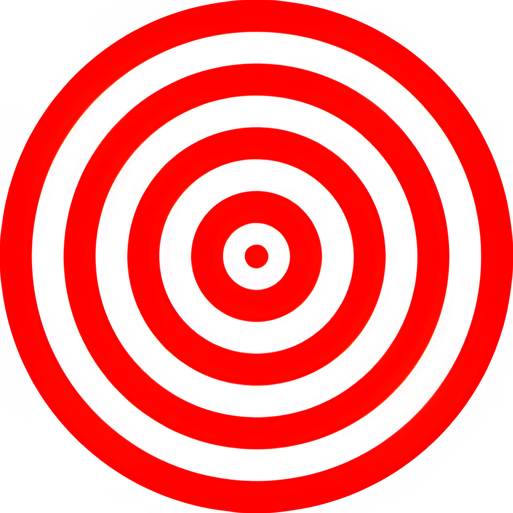
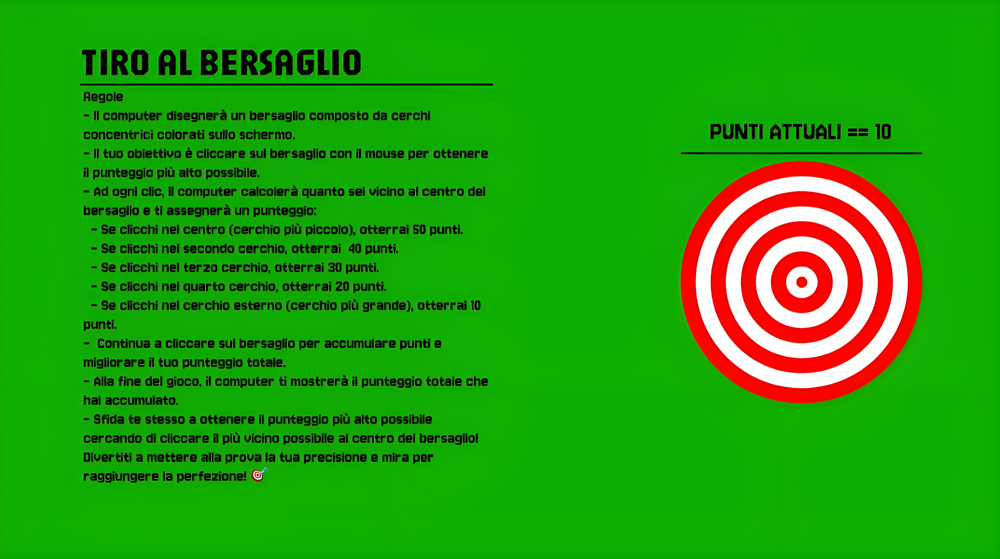

<!-- Improved compatibility of back to top link: See: https://github.com/othneildrew/Best-README-Template/pull/73 -->

<!--
*** Thanks for checking out Shooting-Target-WebGame.
*** If you have any suggestions to improve the game or the README, please fork the repo and create a pull request,
*** or simply open an issue with your ideas. Happy coding!
-->

<!-- PROJECT LOGO -->
 

  

  <h3 align="center">Shooting-Target-WebGame</h3>

  

    A fun HTML, CSS, and JavaScript game where you test your aim by clicking on a target!
     
  

<!-- TABLE OF CONTENTS -->

  
Table of Contents

  <ol>
    <li><a href="#about-the-project">About The Project</a></li>
    <li>
      <a href="#game-rules">Game Rules</a>
    </li>
    <li>
      <a href="#built-with">Built With</a>
    </li>
  </ol>

<!-- ABOUT THE PROJECT -->
## About The Project

[  ]

**Shooting-Target-WebGame** is an interactive browser-based game built with HTML, CSS, and JavaScript. The game challenges your precision as you try to click on a target drawn on the screen. With every click, your score is calculated based on how close you are to the center of the target.

<!-- GAME RULES -->
## Game Rules
- To play the game, just go the github generated page (https://rubenbavaro.github.io/Shooting-Target-WebGame).
- The computer will draw a target made up of colored concentric circles on the screen.
- Your goal is to click on the target with the mouse to get the highest score possible.
- With each click, the computer will calculate how close you are to the center of the target and assign you a score:
  - **Center (smallest circle):** 50 points
  - **Second circle:** 40 points
  - **Third circle:** 30 points
  - **Fourth circle:** 20 points
  - **Outer circle (largest):** 10 points
- Keep clicking on the target to accumulate points and improve your total score.
- At the end of the game, the total score you have accumulated will be displayed.
- **Challenge:** Aim to click as close to the center as possible for maximum points and see if you can beat your high score!

Have fun testing your accuracy and aim to achieve perfection! 🎯

<!-- BUILT WITH -->
## Built With

This game is built using:
* **HTML5** – The markup language for structuring the game.
* **CSS** – Styling and visual effects.
* **JavaScript** – Game logic and interactivity.
